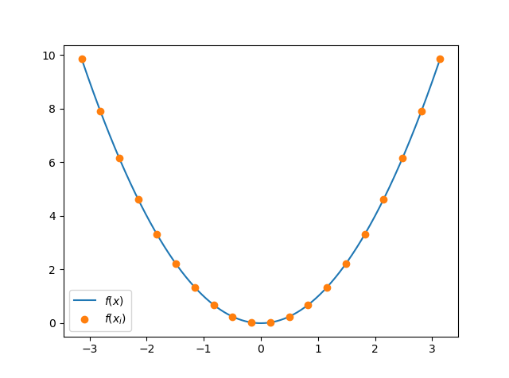
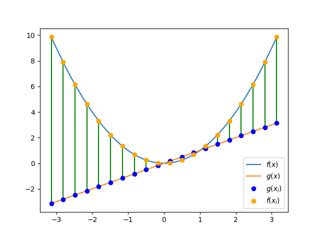

## Why the widget?

While there are already a huge number of resources available which introduce the
Fourier series (including a [truly elegant video](https://youtu.be/r6sGWTCMz2k)
by 3Blue1Brown on Youtube), I hadn't really seen any resources which allow one
to *interact* with it in the way that I wanted. 
To try to address this, a friend of mine and I collaborated to make the 
applet below. 
In it, the user can input whatever (reasonable) function they want using the 
[math.js syntax](https://mathjs.org/docs/expressions/syntax.html)
and it will be plotted in blue.
Then they can adjust the Fourier coefficients with the sliders, plotting the
resulting partial sum in orange.
I'm hoping that, in addition to serving as a fun little exercise for folks who
are already familiar with the Fourier series, it might also serve as a motivator
for those who are just being introduced to it (if only to answer the question
"what is going on with this program?").

So, give it a go and see if you can make the orange plot look like the blue one.
There's some information further down which attempts to explain a little bit 
more about the Fourier series, and which talks about how to choose the
coefficients so that the curves match up.



## What's going on here?

To begin, we have some function $f(x)$ plotted in blue.
This is the function that you can type into the "Enter an equation:" box.
By default it takes the value $f(x) = 4\sin(x) + 5\cos(x/2)$ (for no reason in
particular).
You can type in whatever you want, though. 
Try `x^2` for the familiar parabola or `e^x` for an exponential function.
Note that the function you choose has to be continuous on the domain (here
the interval $[-\pi, \pi]$) for it to be able to be well-approximated by the
orange curve.

Now, what's going on with these sliders and the orange line?
What you might be able to deduce by messing with one slider at a time (while the
rest remain at zero) is that each slider corresponds to a particular function,
and that the value of the slider modulates the amplitude (height) of that
function.
For example, playing with the $b_1$ slider shows the function $\sin(x)$ at
different amplitudes.
Adding another slider with the $+$ button and playing with the $b_2$ slider
shows a function of twice the frequency: $\sin(2x)$. 
The $a_k$ sliders correspond instead to $\cos$ functions of different 
frequencies.
The only exception is the $a_0$ slider -- here it corresponds to the function
$a_0/2$.
The factor of $1/2$ is by convention, and just simplifies explicit calculations
involving the $a_k$'s. 
The orange curve is then just a finite sum of all of these terms. 
In brief:

\begin{align}
s_n(x) &= \frac{a_0}{2} + a_1 \cos(x) + b_1 \sin(x) + a_2 \cos(2x) + b_2\sin(2x)\\\ 
&\\hspace{1cm} + \ldots + a_n \cos(nx) + b_n \sin(nx) \\\ 
&= \frac{a_0}{2} + \sum_{k = 1}^{n} a_k \cos(kx) + b_k \sin(kx)
\end{align}

The claim, then, is that we can tweak these sliders (the values of the $a_k$'s
and $b_k$'s) to approximate $f(x)$ which is any reasonably nice function.
As a brief conceptual exercise, what would we choose for the coefficients if
$f(x) = 3\sin(x) + 7\cos(2x)$?

	

	Click to see the answer
	

	
> Choosing $b_1 = 3$, $a_2 = 7$ and all other coefficients to be zero does the
trick.
In fact, these are the only choices that will work (this fact is non-obvious).

## How to choose the coefficients
All this said, it's not immediately obvious how to choose these coefficients.
If you snoop around on
[Wikipedia](https://www.wikiwand.com/en/Fourier_series#Definition), you'll
probably run into the following formulas:
$$
a_k = \frac{1}{\pi} \int_{-\pi}^{\pi} f(x) \cos(kx) dx
$$
$$
b_k = \frac{1}{\pi} \int_{-\pi}^{\pi} f(x) \sin(kx) dx
$$
While mechanically reasonable (just plug in your function and integrate!) these
integrals are often nontrivial to work out, involving a lot of integration by
parts.
Further, to get a deep conceptual understanding of why these are the right
formulas, it helps to have some experience in Linear Algebra.

For this presentation, we take a little bit of a different approach.
The first step is to ask how we evaluate *how good* our approximation is.
For this we can look to the familiar distance formula in 2-dimensions and then
work our way up to finding the *distance* between functions.
Recall that the distance between two points is given by:
$$
d\bigl((x_1, y_1), (x_2, y_2)\bigr) = \sqrt{(x_2 - x_1)^2 + (y_2 - y_1)^2}
$$
One can understand this from the following figure -- just use the Pythagorean
theorem.



For a concrete example, compute the distance between $(3, 2)$ and $(7, 5)$.

	

	Click here to see the result
	

	
> Writing out the distance formula gives:
$$
d\bigl((3, 2), (7, 5)\bigr) = \sqrt{(3 - 7)^2 + (2 - 5)^2} = \sqrt{25} = 5
$$

If we relabel the points $(x_1, y_1) \to (p_1, p_2)$ and 
$(x_2, y_2) \to (q_1, q_2)$ we can rewrite this distance function as:
$$
d(p, q) = \sqrt{(q_1 - p_1)^2 + (q_2 - p_2)^2} = \sqrt{\sum_{i = 1}^2 (q_i - p_i)^2}
$$

where in the last step we have rewritten the formula using
[summation notation](https://www.khanacademy.org/math/ap-calculus-ab/ab-integration-new/ab-6-3/a/review-summation-notation)
-- this will be important to generalizing to points with more coordinates.
Note that here the subscripts are telling you which *coordinate* you are looking
at, whereas before they were telling you which *point* you were looking at.
We can generalize this to points which have $N$ entries ($N$ is arbitrary), call
them $p = (p_1, p_2, \ldots, p_N)$ and $q = (q_1, q_2, \ldots, q_N)$, and write
the distance formula as:
$$
d(p, q) = \sqrt{\sum_{i = 1}^N (q_i - p_i)^2}
$$

Now, here is the biggest conceptual jump so far: if we break up the domain into
some evenly-spaced points $x_1, x_2, \ldots, x_N$ then we can choose the
coordinates of $p$ to be our function $f$ evaluated at those points:
$$
p = \bigl(f(x_1), f(x_2), \ldots, f(x_N)\bigr)
$$

In the figure below we've plotted a parabola $f(x) = x^2$ in blue, as well as
some points at which the function is evaluated in orange.
Each of the compontents of $p$ are understood to be the $y$-values of of those
points.

What would $p$ be if we choose the evaluation points to be
$(x_1, x_2, x_3, x_4, x_5) = (-2, -1, 0, 1, 2)$ and $f(x) = x^2$?

	

		Click to see the answer
	

	
> $$
p = \bigl( f(x_1), f(x_2), f(x_3), f(x_4), f(x_5) \bigr) = (4, 1, 0, 1, 4)
$$

If we do the same operation to another function $g(x)$, then each of the terms
in the sum $(q_i - p_i)^2 = (g(x_i) - f(x_i))^2$ is just the distance (squared!)
between the selected points.
In the figure below, this is the distance between the orange and the blue
points.

Then the total distance formula gives the sum of all those little distances.
This sort of makes sense as a way to see how similar two functions are: if they
take on similar values at the sample points, then the sum of all those squared
distances will be really small.

Now, if we add in more points (split up the domain more finely) we get more
terms, but the terms don't get any smaller.
To keep this proposed distance formula from going to infinity, we multiply by
the *spacing* between the $x_i$ points -- call this spacing $\Delta x$.
That way, as we make that spacing finer, $\Delta x$ gets smaller so that the
distance function remains bounded:

$$
d(p, q) = \sqrt{\sum_{i = 1}^N \bigl(g(x_i) - f(x_i)\bigr)^2 \Delta x}
$$

But we can recognize this as a [Riemann sum](https://www.khanacademy.org/math/ap-calculus-ab/ab-integration-new/ab-6-3/a/riemann-sums-with-summation-notation)!

If we choose more and more points (that is, let $\Delta x \to 0$), then our
summation turns into an integral.
*That integral* is the thing that we will take to be the distance formula for
our functions:

$$
d(f, g) = \sqrt{\int_{-\pi}^{\pi} \bigl( g(x) - f(x) \bigr)^2 dx}
$$

Note that we integrate over the whole domain because those sample points $x_i$
range over the whole interval $[-\pi, \pi]$. 
One last thing that we do is multiply by $1/\sqrt{\pi}$.
Again, this is by convention and makes sense once one considers this story from
a Linear Algebra perspective -- all this does is rescale the distance.
The final formula that we're left with is called the $L_2$-norm, and is often
denoted by pairs of vertical bars:

$$
||g - f|| = \sqrt{ \frac{1}{\pi} \int_{-\pi}^{\pi} \bigl( g(x) - f(x) \bigr)^2 dx}
$$

The strategy for estimating $f(x)$ with some $g(x)$ (say $s_n(x)$) will then be
to try to minimize this distance function.
This is calculated in the applet (right under the equation input) and the way to
properly choose the coefficients is to use the sliders to minimize that number.
In fact, if you do this minimization one slider at a time (use the first slider
to get $L_2$ as small as possible, add another slider, mess with only the
added slider, then repeat) you will end up with the proper Fourier coefficients!
This is not meant to be obvious -- it seems reasonable that you might need to do
some extra work than just choosing the coefficients one at a time to minimize
the distance.
However, there is a theorem from Linear Algebra that tells us we are justified
in this process. 
And indeed, if we do this, the orange curve almost magically starts to look like
the blue curve.
Give it a try to see what I mean.
